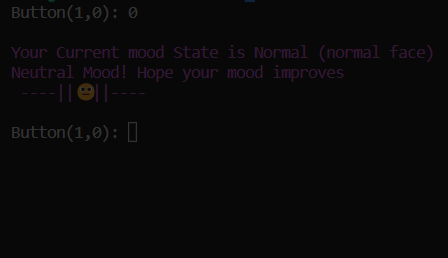
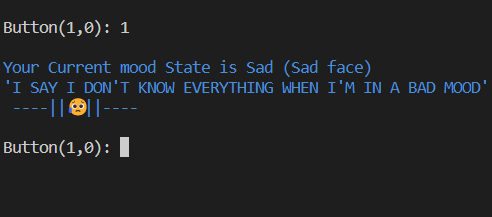
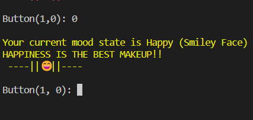
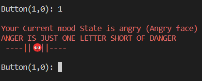

## Finite State Machine (ENTERTAINMENT BILLBOARD)
   

   #### The first step the user should take in order to use the entertainment billboard is to enter one bit input value (1 or 0) to go the next Mood state. Only then can you decide which emoji the program would generate for you with the input value of your choice.
        
        
     

    The initial state of the program is the Normal Mood state or state0 with current state_value of (x1=0,x2=0).
    As the user you need to chose to stay with the normal mood or change your mood. To do so, input value x3=1 will take you to the Sad state while input value x3=0 will let you remain in your current normal mood.

    FOUR MOOD STATES and their cuurent state value
     1. Normal Mood: (x1=0, x2=0)
     2. Sad Mood:    (x1=0, x2=1)
     3. Angry Mood:  (x1=1, x2=0)
     4. Happy Mood:   (x1=1, x2=1)
    Now you want to change your current mood 
    so that the program generates the emoji you want:
    To do so, enter one bit input value based on the next mood state you want as x3(1 or 0).


## All Possible Combinations and  Results

    Three possible ways to get Normal Mood Emoji
      1. initial input value of button= 0.
      2. input value of button=0 from sad mood state
      3.input value of button=0 [from happy mood]

   
    Sad Mood Emoji Combinations
      1. button=1 [from normal mood state]


    Happy Mood Emoji Combinations
      1. button=0 [From angry mood]


    Angry Mood Emoji Combinations
      1. button=1[from sad mood]
      2. button=1[Angry mood itself]



## DIAGRAM,EQUATIONS,K-MAP

 ### The whole process of the FSM(entertainment billboard) is based on these diagrams.
 

     Based on this diagram the following
      truth table consisting of 
      x1,x2 and input, next states, and output was created.


### In the same way, the following K-maps were created based on the above truth table.
    K-map for next-state_moode(x1): 
    The equation derived from the k-map is attached to the k-map. 
    The same equation was used in the code.


        K-map for next-state_moode(x2): 
        The equation derived from the k-map is attached to the k-map. 
        The same equation was used in the code.


        K-map for output(y): 
        The equation derived from the k-map is attached to the k-map. 
        The same equation was used in the code.


[NOTE: since y=x1*x2, which means the input is the current states, the equation for y was used in the if statement since the out for y should be an emoji( that emoji represents the output of y.)An example of how it used in if statement of normal mood is below]


```
/*Outout Equation: y=(x1*x2), so in this case, we want the output to be emojis, so
            we treate the x1 and x2 as values so the program knows the current state, and output the corresponing
            output*/
              // The program will first calculate the next state based on these current_state_values and the input via the above equations
    // Initial State is the Normal_Mood(state)
    x1[i] = 0;
    x2[i] = 0;
    printf("x3: ");
    scanf("%d,%s", &x3[i], y);
    next_state_value1 = get_state_value1();
    next_state_value2 = get_state_value2();

    if (next_state_value1 == 0 && next_state_value2 == 1)
        goto Sad_Mood;
    if (next_state_value1 == 0 && next_state_value2 == 0)
        goto Normal_Mood;
```

### How to run the main.c file in this folder
Compile
```
make
```
Then, execute
```
./main.out
```
