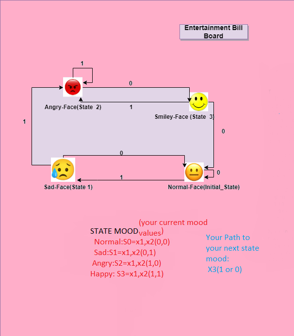
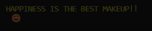
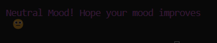
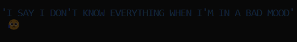
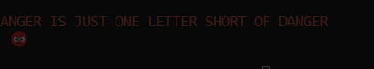
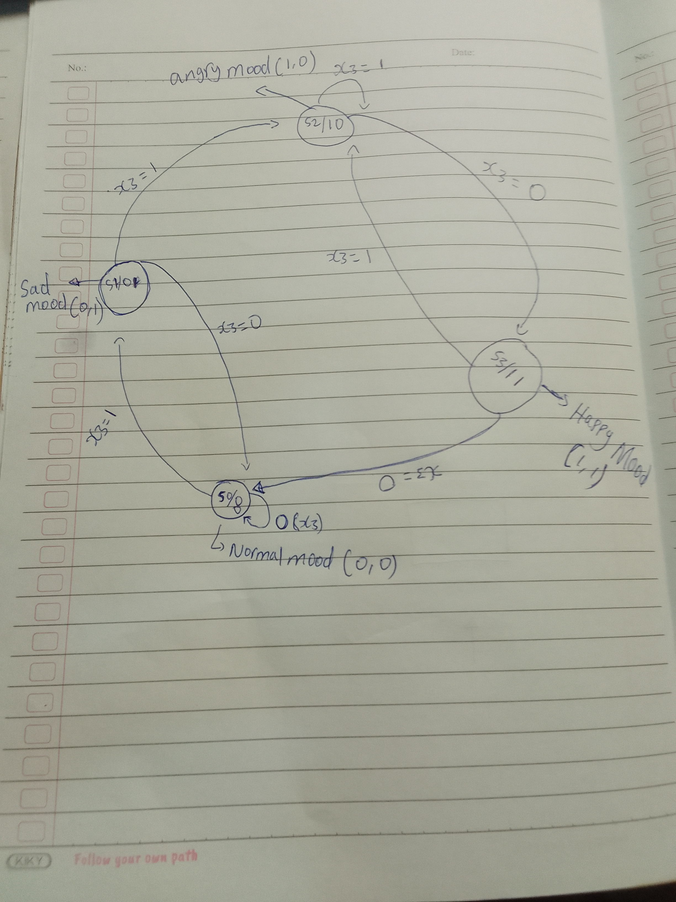
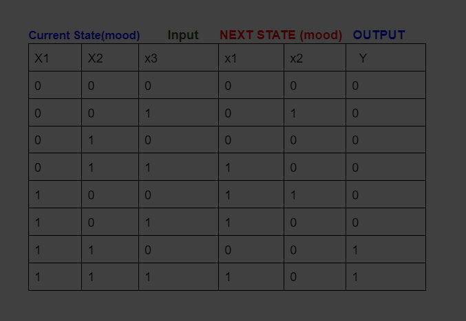
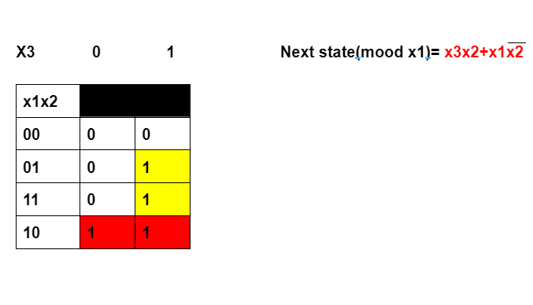
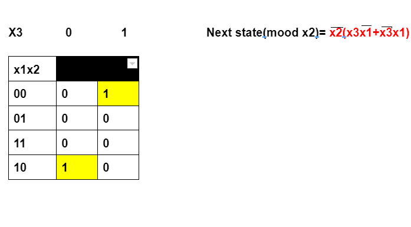
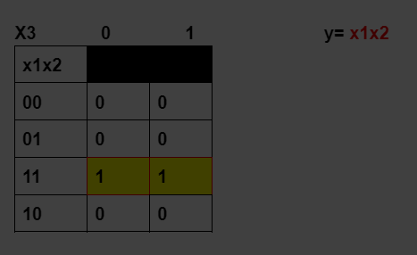

## Finite State Machine (ENTERTAINMENT BILLBOARD)
   

   #### The first step the user should take in order to use the entertainment billboard is to identify temporary current mood. Only then can you decide which emoji the program would generate for you with the input value of your choice.

  

    FOUR MOOD STATES
     1. Normal Mood: (x1=0, x2=0)
     2. Sad Mood:    (x1=0, x2=1)
     3. Angry Mood:  (x1=1, x2=0)
     4. Happy Mood:   (x1=1, x2=1)
    Now you want to change your current mood 
    so that the program generates the emoji you want:
    To do so, as you identify your current mood state(x1,x2) you should also 
    include the input value based on the next mood state you want as x3(1,0).

For example: You want a happy mood, to do so you have to identify the angry mood values(x1=1,x2=0) and enter x3=0 as your transition input value to happy mood state. [IT IS IMPORTANT TO PAY ATTENTION TO HOW THE STATES ARE CONNECTED! ] Yellow colored text followed by SMiley face will pop up as a result of the above values


## All Possible Combinations and  Results

    Three possible ways to get Normal Mood Emoji
      1. x1=0,x2=0,x3=0
      2. x1=1,x2=1,x3=0 [from happy mood + input: x3=0]
      3. x1=0, x2=1, x3=0 [from sad mood + input: x3=0]

   
    Sad Mood Emoji Combinations
      1. x1=0, x2=0, x3=1 [from normal mood + input x3=0]


    Happy Mood Emoji Combinations
      1. x1=1, x2=0, x3=0 [From angry mood + input x3=0]


    Angry Mood Emoji Combinations
      1. x1=0, x2=1,x3=1[from sad mood + input x3=1]
      2. x1=1, x2=0,x3=1[Angry mood itself + input x3=1]



## DIAGRAM,EQUATIONS,K-MAP

 ### The whole process of the FSM(entertainment billboard) is based on these diagrams.
 

     Based on this diagram the following
      truth table consisting of 
      x1,x2 and input, next states, and output was created.



### In the same way, the following K-maps were created based on the above truth table.
    K-map for next-state_moode(x1): 
    The equation derived from the k-map is attached to the k-map. 
    The same equation was used in the code.


        K-map for next-state_moode(x2): 
        The equation derived from the k-map is attached to the k-map. 
        The same equation was used in the code.


        K-map for output(y): 
        The equation derived from the k-map is attached to the k-map. 
        The same equation was used in the code.


[NOTE: since y=x1*x2, which means the input is the current states, the equation for y was used in the if statement since the out for y should be an emoji( that emoji represents the output of y.)]


```
/*Outout Equation: y=(x1*x2), so in this case, we want the output to be emojis, so
            we treate the x1 and x2 as values so the program knows the current state, and output the corresponing
            output*/
            if (next_state_value1 == 1 && next_state_value2 == 1)
            {
                y = (YELLOW"HAPPINESS IS THE BEST MAKEUP!!\n \U0001F604\n"); // smiley face
            }
            else if (next_state_value1 == 1 && next_state_value2 == 0)
            {
                y = (RED "ANGER IS JUST ONE LETTER SHORT OF DANGER\n \U0001F621\n"); // angry face
            }
            else if (next_state_value1 == 0 && next_state_value2 == 0)
            {
                y = (MAGENTA"Neutral Mood! Hope your mood improves\n \U0001F610\n"); // normal face
            }
            else if (next_state_value1 == 0 && next_state_value2 == 1)
            {
                y = (BLUE"'I SAY I DON'T KNOW EVERYTHING WHEN I'M IN A BAD MOOD'\n \U0001F625\n"); // sad face
            }

            printf("\n%s\n", y);

```

### How to run the main.c file in this folder
Compile
```
make
```
Then, execute
```
./main.out
```
